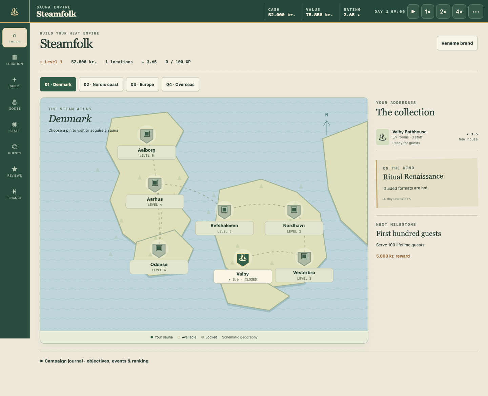
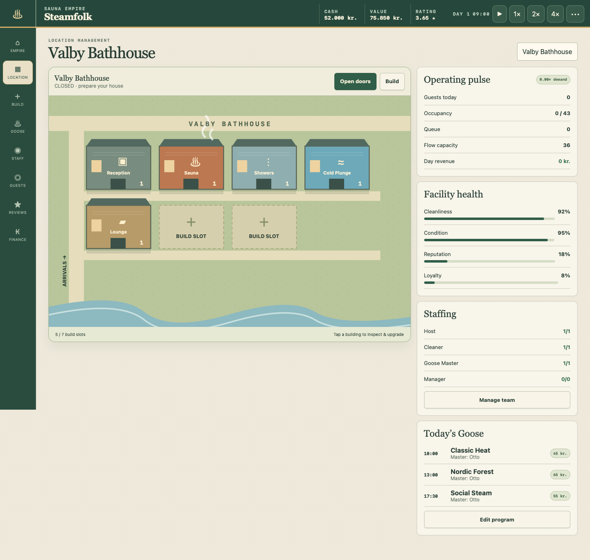

# Sauna Sim

**Build a sauna concept, learn what local guests value, and grow it into a respected sauna empire.**

Sauna Sim is a browser-based management game about running distinctive sauna venues. The player combines locations, buildings, amenities, staff, prices, and custom Aufguss programs, then reads guest behaviour and business results to improve the concept. The aim is not only to maximise a spreadsheet: every operational choice should become visible in the venue and meaningful to the people visiting it.



## Project status

Sauna Sim is an in-development prototype, not a finished release. This repository currently contains two playable implementations:

| Version | Purpose | Status | Start here |
| --- | --- | --- | --- |
| **Canal Workshop prototype** | The current modular React/Phaser implementation used to prove the first venue, its simulation, and the intended production architecture. | Playable first venue with placeholder and draft art. | Run the root Vite app. |
| **Sauna Empire rebuild** | A broader self-contained management build with 48 markets and more of the long-term empire loop. | Playable reference build with desktop/mobile QA coverage. | Open `empire-rebuild/sauna-empire-no-sprites-rc.html`. |

The detailed design describes the intended full game. It is broader than the systems currently implemented in the Canal prototype. See [Game systems and implementation status](docs/game-systems-map-v0.1.md) for the exact boundary between working code and planned design.

## The game

You begin with a modest sauna venue and shape its identity through practical and creative decisions:

- choose a site and compatible building base;
- hire and develop Aufguss Masters and service staff;
- create reusable Gus programs from heat, duration, aromas, music, performance, and recovery;
- set opening hours, admission, session frequency, and supplement prices;
- build facilities such as sauna rooms, showers, recovery areas, shops, and outdoor amenities;
- observe attendance, queues, guest reactions, revenue, condition, and reputation;
- repair, upgrade, borrow, expand, or sell as the concept grows.

The simulation intentionally keeps some market preferences hidden. Players learn by watching what guests do, what they say, and whether the venue's promise matches its physical delivery.

### Core loop

1. Review the venue, staff, guest response, and finances.
2. Adjust programs, pricing, service, amenities, or opening hours.
3. Run time forward and inspect the outcome.
4. Improve the venue or invest in a new opportunity.
5. Keep, adapt, scale, or sell the concept.

### Full empire objective

The Sauna Empire reference build reaches campaign victory at eight owned locations, an empire value of 1.5 million kr., and an average rating of 4.25. Play can continue after victory. Sustained insolvency can end the campaign.

## Play the Canal Workshop prototype

### Requirements

- Node.js 22.12 or newer
- pnpm
- a modern desktop or mobile browser

### Install and run

```sh
pnpm install
pnpm dev
```

Open the local address printed by Vite, normally `http://localhost:5173`.

Create a production build with:

```sh
pnpm build
pnpm preview
```

### Controls

The prototype is controlled with mouse or touch:

- use the management tabs below the venue to open Overview, Programs, Team, Venue, Shop, Guests, and Finance;
- select guests or visible venue fields to inspect them;
- configure and save a Gus program before running the week;
- use the development-only time controls when running the Vite development build to resolve timed work quickly.

The current Canal loop advances one week at a time. A deterministic real-time and offline simulation is planned before broader external testing.

## Play the Sauna Empire reference build

For the simplest offline launch, open this file directly in a browser:

```text
empire-rebuild/sauna-empire-no-sprites-rc.html
```

It bundles its scripts, styles, and vector scenes and does not require network access. Alternatively, serve the folder locally and open `empire-rebuild/index.html`:

```sh
python3 -m http.server 5188 --bind 127.0.0.1 --directory empire-rebuild
```

Then visit `http://127.0.0.1:5188`.

The Empire map contains 48 locations across Denmark, the Nordic region, Europe, and overseas markets. Select a map pin—or a location button on mobile—to inspect an opportunity or manage an owned venue. Open a venue, prepare its staffing and program, and use **Open doors** or the play control to advance operations.

More detail: [Sauna Empire rebuild guide](empire-rebuild/README.md).

## Saves and recovery

Both playable versions save locally in the browser, but they use separate save formats and storage keys.

- The Canal prototype autosaves locally and supports JSON export/import.
- Sauna Empire uses the `saunaEmpireRebuild` browser-storage key and can migrate older `saunaEmpireRC` state.
- Browser file previews and local servers may use different storage origins. JSON export/import is the safest way to move a save between them.
- A loaded Sauna Empire game begins paused. Offline settlement is capped at eight hours and applies once per elapsed interval.

Keep exported JSON backups before changing browser storage, switching launch method, or testing save migration.

## Tests and verification

Run the Canal and shared Vitest suites while excluding the standalone Node test:

```sh
pnpm exec vitest run --exclude empire-rebuild/core.test.mjs
```

Run the Sauna Empire system/scenario suite separately:

```sh
node --test empire-rebuild/core.test.mjs
```

Build and bundle checks:

```sh
pnpm build
pnpm check:bundle
```

The tracked `empire-rebuild/qa/` folder contains desktop and mobile screenshots plus browser-flow results. Generated local runs under `output/`, `playwright-report/`, and `test-results/` are intentionally ignored by Git.

## Current implementation boundary

The Canal prototype currently includes:

- one playable Canal Workshop venue;
- venue economics, construction, loans, staffing, shop, maintenance, and repairs;
- a modular Aufguss program builder with composition and delivery evaluation;
- weekly guest samples, route playback, feedback, and inspection;
- local autosave plus JSON export/import;
- a React management interface and Phaser exterior scene.

The larger intended game still needs real-time/offline simulation, multiple production-ready locations and buildings, deeper guest memory and local markets, chain-wide brand/ranking systems, final character animation, sound, localisation, and final art production.

The approved priority is content data and numerical balance first, followed by final graphics. See [Remaining work](docs/remaining-work-overview-v0.1.md) for the maintained roadmap.

## Repository map

```text
assets/           Source, production, sprite, effect, and UI art
docs/             Game design, system contracts, audits, and production specs
empire-rebuild/   Self-contained 48-location reference implementation and QA
public/           Runtime assets and visual design prototypes
scripts/          Build and bundle utilities
src/content/      Validated content and scene contracts
src/game/         Phaser exterior scene
src/save/         Save validation and persistence
src/sim/          Deterministic business simulation
src/ui/           React management interface
tests/            Scenario and end-to-end tests
```

Start with these documents:

- [Documentation index](docs/README.md)
- [Game design document](docs/gdd-v0.1.md)
- [Game systems map](docs/game-systems-map-v0.1.md)
- [First gameplay specification](docs/first-gameplay-spec-v0.1.md)
- [Technical blueprint](docs/technical-blueprint-v0.1.md)
- [Decision log](docs/decision-log.md)
- [Remaining work](docs/remaining-work-overview-v0.1.md)

When documents disagree, follow the canonical reading order in the [documentation index](docs/README.md).

## Visual direction

The intended game uses a top-down pixel-art exterior combined with a phone-like management interface. Interiors are managed through UI rather than architectural cutaways. Buildings, upgrades, routes, guests, and effects are authored as separate layers so the venue can visibly change without turning the game into a tile-by-tile construction simulator.



Current sprite and building images include approved concepts, provisional production work, and rejected drafts. Their status is recorded in the relevant `assets/**/README.md` files; presence in the repository does not automatically mean an asset is approved for the final game.

## Contributing

Before changing simulation rules or content contracts, read [AGENTS.md](AGENTS.md), the [documentation index](docs/README.md), and the relevant system document. Stable design decisions belong in the decision log, and gameplay changes should include deterministic tests where practical.

## License

No open-source licence has been selected for this project. Do not assume permission to redistribute the code or assets.
